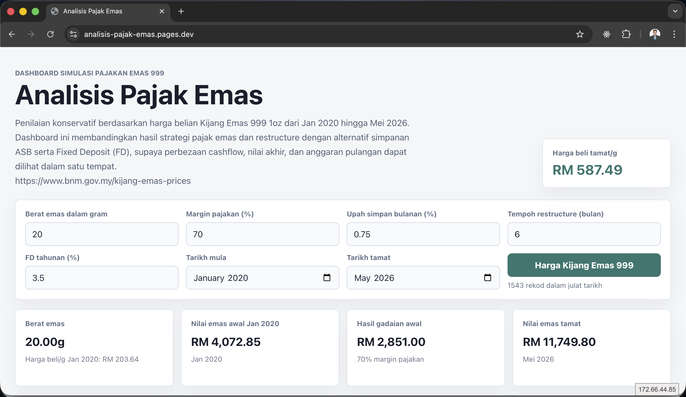
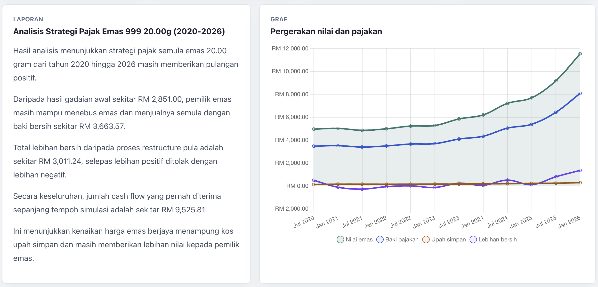
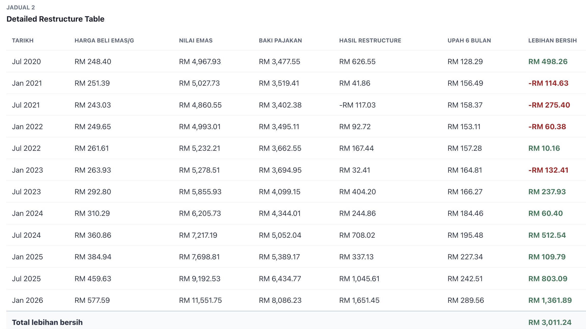
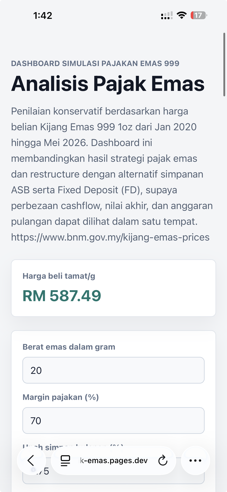

<div align="center">

# Analisis Pajak Emas

**Gold pawn analytics dashboard using Vue.js and historical BNM Kijang Emas data.**

[](https://vuejs.org/)
[](https://vitejs.dev/)
[](https://pages.cloudflare.com/)
[](LICENSE)
[](https://analisis-pajak-emas.pages.dev/)

[Live Demo](https://analisis-pajak-emas.pages.dev/) · [Repository](https://github.com/ahmadzainuddin/Analisis-Pajak-Emas)

</div>

## Overview

Analisis Pajak Emas is a financial analytics dashboard for Ar-Rahnu gold pawn strategy simulation using Vue.js and historical Bank Negara Malaysia Kijang Emas data. It models a gold pawn and restructure strategy, calculates cashflow movement, estimates redemption cost, and compares the outcome against ASB and Fixed Deposit alternatives.

The project is designed as a recruiter-friendly fintech and data analytics portfolio piece. It demonstrates frontend dashboard development, financial logic implementation, chart visualization, historical data handling, and Malaysian market context in a single deployed application.

## Features

- Interactive Ar-Rahnu / pajak emas simulation using adjustable assumptions.
- Historical Bank Negara Malaysia Kijang Emas price dataset.
- Gold valuation based on conservative buying price per gram.
- Pawn margin, storage fee, restructure surplus, and redemption cost calculations.
- Detailed restructure table by selected interval.
- Summary comparison of initial pawn proceeds, current gold value, redemption cost, and total cashflow.
- Investment comparison against ASB dividend history and Fixed Deposit compounding.
- Chart.js line visualization for gold value, pawn balance, storage fee, and net surplus.
- Responsive Vue dashboard suitable for desktop and mobile review.
- Local JSON data model for fast static deployment.

## Key Insights

- Historical gold appreciation from 2020-2026 outperformed ASB and Fixed Deposit simulations.
- Rolling restructure strategy generated positive net surplus during strong gold market periods.
- Gold price appreciation successfully offset storage fees in the simulation.
- The dashboard demonstrates leveraged cashflow behavior using Ar-Rahnu concepts.

## Screenshots

<p align="center">
  
</p>

<p align="center">
  
</p>

<p align="center">
  
</p>

<p align="center">
  
</p>

Additional portfolio views:

| Section | Screenshot |
| --- | --- |
| Dashboard summary cards | `docs/screenshots/dashboard-summary-cards.png` |
| Summary comparison table | `docs/screenshots/summary-comparison-table.png` |
| Investment comparison table | `docs/screenshots/investment-comparison-table.png` |
| ASB compounding table | `docs/screenshots/asb-compounding-table.png` |
| FD compounding table | `docs/screenshots/fd-compounding-table.png` |
| Kijang Emas price data table | `docs/screenshots/price-data-table.png` |

## How It Works

The dashboard loads historical Kijang Emas prices and ASB dividend records from local JSON files. Users can adjust the gold weight, pawn margin, monthly storage fee, restructure interval, FD rate, and simulation date range.

For each selected period, the app estimates the gold value, pawn balance, restructure proceeds, storage fee, net surplus, redemption cost, and total cashflow. The output is then compared with ASB and FD compounding to show whether the simulated pajak emas strategy performs better or worse than alternative savings instruments.

## Methodology

The simulation uses historical Bank Negara Malaysia Kijang Emas buying prices from January 2020 to May 2026.

A conservative Ar-Rahnu strategy is simulated using:

- 70% pawn margin
- 0.75% monthly storage fee
- 6-month restructure interval

Cashflow, redemption cost, restructure surplus, and investment comparison are calculated using historical gold appreciation and compounding assumptions.

## Financial Logic

The calculation logic is intentionally transparent and conservative. It uses the Kijang Emas buying price as the basis for pawn value, restructure value, and resale value.

| Metric | Formula |
| --- | --- |
| Price per gram | `one_oz_buying / 31.1035` |
| Gold value | `buying_price_per_gram * weight_gram` |
| Initial pawn proceeds | `initial_gold_value * pawn_margin_percent` |
| Current pawn value | `current_gold_value * pawn_margin_percent` |
| Restructure proceeds | `current_pawn_value - previous_pawn_balance` |
| Storage fee | `previous_pawn_balance * monthly_storage_rate * restructure_months` |
| Net surplus | `restructure_proceeds - storage_fee` |
| Redemption cost | `latest_pawn_balance` |
| Net after redeem and sell | `current_gold_value - redemption_cost` |
| Total net surplus | `sum(all restructure net surplus)` |
| Total cashflow | `initial_pawn_proceeds + net_after_redeem_and_sell + total_net_surplus` |
| FD value | `principal * (1 + annual_rate) ^ years` |
| ASB value | yearly compounding using historical dividend + bonus rates |

Nota ringkas: Simulasi ini bukan nasihat kewangan. Ia hanya model analisis berdasarkan andaian pengguna dan data sejarah. Kos sebenar Ar-Rahnu, margin pajakan, caj simpanan, spread harga emas, dan polisi institusi mungkin berbeza.

## Data Source

- Historical Kijang Emas prices: [Bank Negara Malaysia Kijang Emas Prices](https://www.bnm.gov.my/kijang-emas-prices)
- Local gold price dataset: `src/data/kijang-emas-prices.json`
- Local ASB dividend dataset: `src/data/asb-dividends.json`

The dashboard uses the BNM Kijang Emas buying price to keep resale and pawn valuation assumptions conservative.

## Tech Stack

- [Vue 3](https://vuejs.org/) for reactive dashboard UI.
- [Vite](https://vitejs.dev/) for development and production builds.
- [Chart.js](https://www.chartjs.org/) and [vue-chartjs](https://vue-chartjs.org/) for data visualization.
- JavaScript ES Modules.
- Local JSON datasets.
- Cloudflare Pages for static deployment.

## Installation

Clone the repository:

```bash
git clone https://github.com/ahmadzainuddin/Analisis-Pajak-Emas.git
cd Analisis-Pajak-Emas
```

Install dependencies:

```bash
npm install
```

Start the local development server:

```bash
npm run dev
```

Build for production:

```bash
npm run build
```

Preview the production build locally:

```bash
npm run preview
```

## Deployment

Current production deployment:

[https://analisis-pajak-emas.pages.dev/](https://analisis-pajak-emas.pages.dev/)

Recommended Cloudflare Pages settings:

| Setting | Value |
| --- | --- |
| Framework preset | Vite |
| Build command | `npm run build` |
| Build output directory | `dist` |
| Node version | 18+ or 20+ |

Deployment flow:

1. Push changes to GitHub.
2. Connect the repository to Cloudflare Pages.
3. Use the Vite build command and `dist` output directory.
4. Deploy and verify the dashboard, charts, tables, and mobile layout.

## Repository Description

Short version:

> Gold pawn analytics dashboard using Vue.js and historical BNM Kijang Emas data.

Long version:

> Financial analytics dashboard for Ar-Rahnu gold pawn strategy simulation using Vue.js and historical Bank Negara Malaysia Kijang Emas data. Includes restructure analysis, cashflow simulation, redemption cost analysis, and comparison against ASB and Fixed Deposit.

## GitHub Topics

Recommended repository topics:

```text
vuejs
vite
fintech
malaysia
gold
ar-rahnu
dashboard
analytics
chartjs
financial-analysis
data-visualization
cloudflare-pages
kijang-emas
bank-negara-malaysia
investment-analysis
```

## Project Structure

Current structure:

```text
.
├── index.html
├── package.json
├── package-lock.json
├── vite.config.js
└── src
    ├── App.vue
    ├── main.js
    └── data
        ├── asb-dividends.json
        └── kijang-emas-prices.json
```

Suggested production structure:

```text
.
├── public
│   └── screenshots
├── src
│   ├── assets
│   ├── components
│   ├── data
│   ├── utils
│   ├── App.vue
│   └── main.js
├── docs
├── README.md
├── PROJECT_STRUCTURE.md
├── CHANGELOG.md
├── CONTRIBUTING.md
├── LICENSE
├── package.json
└── vite.config.js
```

See [PROJECT_STRUCTURE.md](PROJECT_STRUCTURE.md) for the full structure recommendation.

## GitHub Profile Showcase

Suggested portfolio description:

> Analisis Pajak Emas is a Malaysian fintech simulation project and financial dashboard built with Vue.js. It uses historical BNM Kijang Emas data to model Ar-Rahnu gold pawn restructure strategies, cashflow movement, redemption cost, and investment comparison against ASB and Fixed Deposit.

Portfolio positioning:

- Financial dashboard.
- Data analytics project.
- Malaysian fintech simulation project.
- Vue.js and Chart.js frontend showcase.
- Cloud/Data Analyst portfolio project with real historical market data.

## Future Improvements

- PDF export for simulation reports.
- AI forecasting for scenario analysis.
- Gold price prediction using historical trend models.
- Multiple pawn institution profiles and fee structures.
- Real-time gold price API integration.
- User authentication and saved scenarios.
- Historical comparison tools by date range.
- CSV upload for custom price datasets.
- Exportable charts and tables.
- Sensitivity analysis for margin, fee, and price movement.

## Disclaimer

This project is for educational, analytics, and portfolio demonstration purposes only. It is not financial, investment, legal, or Shariah advisory. The calculations are based on historical data and user-defined assumptions. Actual Ar-Rahnu terms, gold spreads, storage fees, redemption rules, institution policies, and market conditions may differ.

Always verify assumptions with the relevant financial institution and consult a qualified professional before making financial decisions.

## Author

**Developed by Ahmad Zainuddin**

BSc (Hons) Information Technology candidate at Malaysia University of Science and Technology (MUST), with interests in data science, cloud computing, fintech systems, and financial analytics.

This project demonstrates historical gold price analysis, Ar-Rahnu simulation, cashflow modeling, and investment comparison using Vue.js and real Malaysian financial datasets.

Areas of interest:
Financial analytics, cloud computing, fintech systems, data visualization, and AI-assisted applications.

Relevant coursework:

- Data Science
- Business Analytics & Artificial Intelligence
- Applied Statistics
- Object-Oriented Analysis & Design
- System Analysis and Design
- Software Engineering
- Data Structures & Algorithms

- GitHub: [@ahmadzainuddin](https://github.com/ahmadzainuddin)
- Project: [Analisis Pajak Emas](https://github.com/ahmadzainuddin/Analisis-Pajak-Emas)
- Live Demo: [analisis-pajak-emas.pages.dev](https://analisis-pajak-emas.pages.dev/)

## License

This project is licensed under the [MIT License](LICENSE).
